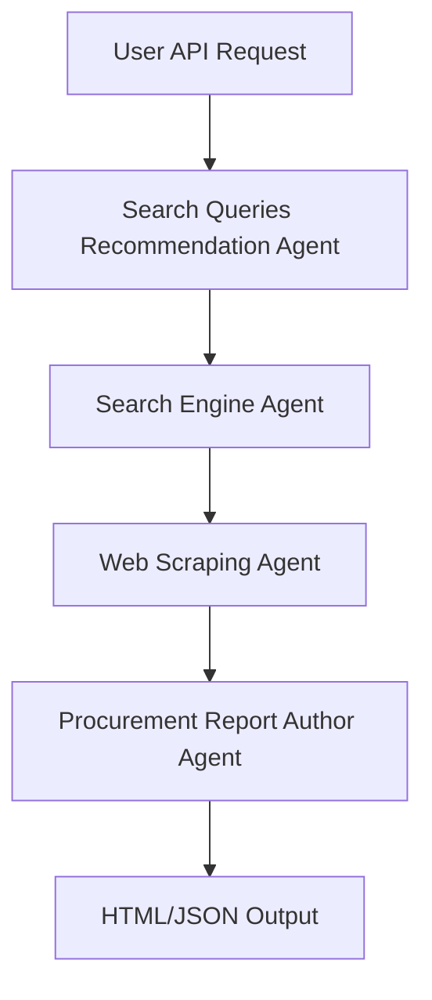
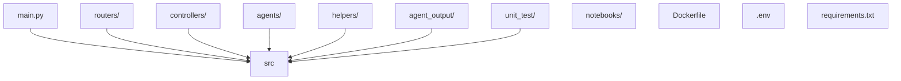
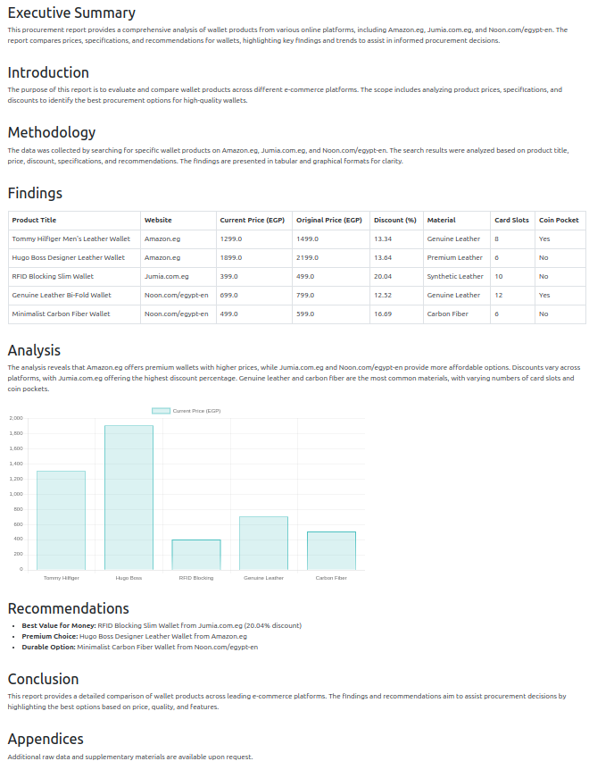

# Agentic Procurement Assistant

A modular, agent-based system that automates product research, extraction, and procurement report generation using AI and web automation.

---

## Table of Contents
1. [Overview](#overview)
2. [Architecture & Workflow](#architecture--workflow)  
   - [Workflow Diagram](#workflow-diagram)  
   - [File Structure Diagram](#file-structure-diagram)
3. [Technologies Used](#technologies-used)
4. [Detailed File Explanations](#detailed-file-explanations)  
   - [Dockerfile](#dockerfile)  
   - [main.py](#mainpy)  
   - [unit_test/](#unittest)  
   - [routers/](#routers)  
   - [helpers/](#helpers)  
   - [agents/](#agents)  
   - [controllers/](#controllers)
5. [Agentic Procurement Assistant API](#agentic-procurement-assistant-api)
6. [Endpoint](#endpoint)
7. [Input Parameters](#input-parameters)
8. [Response](#response)
9. [Quickstart](#quickstart)
10. [Contact](#contact)

---

## Overview

**Agentic Procurement Assistant** leverages a crew of AI agents to automate the procurement process:
- Recommends search queries for products.
- Searches e-commerce platforms.
- Scrapes product details.
- Generates a professional procurement report (HTML).

---

## Architecture & Workflow

### Workflow Diagram



### File Structure Diagram



---

## Technologies Used

- crewai
- tavily-python
- scrapegraph-py
- fastapi
- uvicorn[standard]
- python-multipart
- pydantic
- python-dotenv
- pytest

---

## Detailed File Explanations

### Dockerfile

- **Purpose:**  
  Containerizes the application for consistent deployment and execution.
- **What it does:**  
  - Sets up a Python environment.
  - Installs dependencies from `requirements.txt`.
  - Copies the application code into the container.
  - Sets environment variables and exposes the necessary port.
  - Defines the default command to run the FastAPI server.
- **Tools Used:**  
  Docker, Python, Uvicorn.

---

### main.py

- **Purpose:**  
  Entry point for the FastAPI application.
- **What it does:**  
  - Initializes the FastAPI app.
  - Includes routers (API endpoints).
  - Starts the application server.
- **Tools Used:**  
  FastAPI, Uvicorn.

---

### unit_test/

- **Purpose:**  
  Contains automated tests to ensure code correctness.
- **What it does:**  
  - `test_procurement_report.py`: Tests the procurement report generation logic, including agent orchestration.
- **Tools Used:**  
  Pytest, FastAPI TestClient.

---

### routers/

- **Purpose:**  
  Defines API endpoints and request/response handling.
- **What it does:**  
  - `CrewRouter.py`: Implements the `/api/get_procurement_review` endpoint.
  - Calls the controller to run the agent workflow, and returns the output file.
- **Tools Used:**  
  FastAPI APIRouter, Pydantic.

---

### helpers/

- **Purpose:**  
  Provides utility functions and configuration management.
- **What it does:**  
  - `config.py`: Loads environment variables and configuration settings (e.g., API keys, file paths) for use throughout the app.
- **Tools Used:**  
  Python `os`, dotenv.

---

### agents/

- **Purpose:**  
  Defines the agents, their tasks, tools, and output schemas.
- **What it does:**  
  - `config/agents.yaml`: YAML file specifying agent role, goal, and backstory.
  - `config/tasks.yaml`: YAML file defining the sequence and dependencies of tasks.
  - `output_schema.py`: Pydantic models that define the structure of agent outputs (e.g., search results, product details).
  - `tools.py`: Integrates external tools (Tavily for search, Scrapegraph for scraping) and provides a unified interface for agents to use them.
- **Tools Used:**  
  CrewAI, Pydantic, Tavily, Scrapegraph, YAML.

---

### controllers/

- **Purpose:**  
  Orchestrates the workflow of agents and manages the overall process.
- **What it does:**  
  - `CrewControllers.py`: Loads agent and task configurations, initializes agents, runs them in the correct order, collects outputs, and generates the final procurement report (HTML/JSON).
- **Tools Used:**  
  CrewAI, Python, file I/O.

---

### Agentic Procurement Assistant API

> Hosted at:  
`https://A7medAyman-Agentic-Procurement-Assistant.hf.space/api/get_procurement_review`

---

## Endpoint

**Method**: `POST`  
**URL**: `/api/get_procurement_review`  
**Content-Type**: `multipart/form-data`

---

## Input Parameters

| Parameter        | Type        | Required | Default Value                                                                 | Description |
|------------------|-------------|----------|--------------------------------------------------------------------------------|-------------|
| `product_name`   | `string`    | ✅ Yes   | —                                                                              | The name of the product to analyze. This is the central input around which the procurement report will be built. |
| `websites_list`  | `List[str]` | ❌ No    | `["www.amazon.eg", "www.jumia.com.eg", "www.noon.com/egypt-en"]`             | A list of e-commerce websites from which the product data should be scraped. The more relevant the websites, the more accurate and insightful the report will be. |
| `country_name`   | `string`    | ❌ No    | `"Egypt"`                                                                      | The country context. This may influence the language, currency, product availability, and local trends. |
| `no_keywords`    | `int`       | ❌ No    | `5`                                                                            | The number of keywords to extract and recommend from the scraped product reviews and web content. These keywords can highlight product strengths, concerns, or features. |
| `language`       | `string`    | ❌ No    | `"English"`                                                                    | The output language of the final report. You can use `"Arabic"` or `"English"` (and more if supported in your backend). |

---

## Response

- **File:** `procurement_report.html`
- **Content:** A professional HTML report with product tables, price comparisons, and recommendations.
- **test output** 


--- 
## Quickstart

1. **Clone the repository:**
   ```sh
   git clone git@github.com:AhmedAyman77/Agentic-Procurement-Assistant.git
   cd Agentic-Procurement-Assistant
   ```

2. **active your conda env**
    ```
    conda activate your_env_name
    ```

3. **Install dependencies:**
   ```sh
   pip install -r requirements.txt
   ```

4. **Set up environment variables:**
   ```sh
   cp src/.env.example src/.env
   ```
   Edit `src/.env` and fill in your API keys.

5. **Run the FastAPI server:**
   ```sh
   cd src
   uvicorn main:app --reload --host 0.0.0.0 --port 5000
   ```

6. **Access the API docs:**
   ```sh
   $BROWSER http://localhost:5000/docs
   ```


## Contact

For questions or support, please contact:  
**Email:** devahmedaymn@gmail.com  
**LinkIn:** [Link](https://www.linkedin.com/in/ahmed-ayman-25a9b2248/)