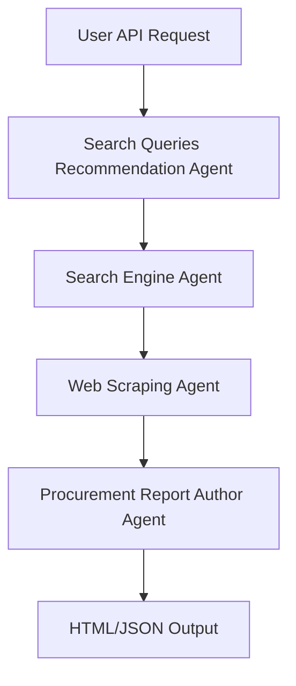
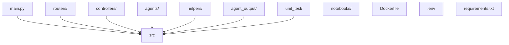

# Agentic Procurement Assistant

A modular, agent-based system that automates product research, extraction, and procurement report generation using AI and web automation.

---

## Table of Contents

1. [Overview](#overview)
2. [Architecture & Workflow](#architecture--workflow)
    - [Workflow Diagram](#workflow-diagram)
    - [File Structure Diagram](#file-structure-diagram)
3. [Detailed File Explanations](#detailed-file-explanations)
    - [Dockerfile](#dockerfile)
    - [main.py](#mainpy)
    - [unit_test/](#unittest)
    - [routers/](#routers)
    - [helpers/](#helpers)
    - [agents/](#agents)
    - [controllers/](#controllers)
4. [API Usage Example](#api-usage-example)
5. [Deployed API Endpoint](#deployed-api-endpoint)
6. [Additional Notes](#additional-notes)

---

## Overview

**Agentic Procurement Assistant** leverages a crew of AI agents to automate the procurement process:
- Recommends search queries for products.
- Searches e-commerce platforms.
- Scrapes product details.
- Generates a professional procurement report (HTML).

---

## Architecture & Workflow

### Workflow Diagram



### File Structure Diagram



---

## Detailed File Explanations

### Dockerfile

- **Purpose:**  
  Containerizes the application for consistent deployment and execution.
- **What it does:**  
  - Sets up a Python environment.
  - Installs dependencies from `requirements.txt`.
  - Copies the application code into the container.
  - Sets environment variables and exposes the necessary port.
  - Defines the default command to run the FastAPI server.
- **Tools Used:**  
  Docker, Python, Uvicorn.

---

### main.py

- **Purpose:**  
  Entry point for the FastAPI application.
- **What it does:**  
  - Initializes the FastAPI app.
  - Includes routers (API endpoints).
  - Sets up middleware and CORS if needed.
  - Starts the application server.
- **Tools Used:**  
  FastAPI, Uvicorn.

---

### unit_test/

- **Purpose:**  
  Contains automated tests to ensure code correctness.
- **What it does:**  
  - `test_procurement_report.py`: Tests the procurement report generation logic, including agent orchestration and output validation.
- **Tools Used:**  
  Pytest, FastAPI TestClient.

---

### routers/

- **Purpose:**  
  Defines API endpoints and request/response handling.
- **What it does:**  
  - `CrewRouter.py`: Implements the `/api/get_procurement_review` endpoint.
  - Handles input validation, calls the controller to run the agent workflow, and returns the output file.
- **Tools Used:**  
  FastAPI APIRouter, Pydantic.

---

### helpers/

- **Purpose:**  
  Provides utility functions and configuration management.
- **What it does:**  
  - `config.py`: Loads environment variables and configuration settings (e.g., API keys, file paths) for use throughout the app.
- **Tools Used:**  
  Python `os`, dotenv.

---

### agents/

- **Purpose:**  
  Defines the agents, their tasks, tools, and output schemas.
- **What it does:**  
  - `config/agents.yaml`: YAML file specifying agent roles, prompts, and settings.
  - `config/tasks.yaml`: YAML file defining the sequence and dependencies of tasks.
  - `output_schema.py`: Pydantic models that define the structure of agent outputs (e.g., search results, product details).
  - `tools.py`: Integrates external tools (Tavily for search, Scrapegraph for scraping) and provides a unified interface for agents to use them.
- **Tools Used:**  
  CrewAI, Pydantic, Tavily, Scrapegraph, YAML.

---

### controllers/

- **Purpose:**  
  Orchestrates the workflow of agents and manages the overall process.
- **What it does:**  
  - `CrewControllers.py`: Loads agent and task configurations, initializes agents, runs them in the correct order, collects outputs, and generates the final procurement report (HTML/JSON).
- **Tools Used:**  
  CrewAI, Python, file I/O.

---

## API Usage Example

### Request

```bash
curl -X POST "https://A7medAyman-Agentic-Procurement-Assistant.hf.space/api/get_procurement_review" \
  -H "Content-Type: application/json" \
  -d '{
        "product": "Gaming Laptop",
        "country": "US",
        "currency": "USD",
        "max_results": 5
      }' --output procurement_report.html
```

### Response

- **File:** `procurement_report.html`
- **Content:** A professional HTML report with product tables, price comparisons, and recommendations.

---

## Deployed API Endpoint

**Base URL:**  
[https://A7medAyman-Agentic-Procurement-Assistant.hf.space/api/get_procurement_review](https://A7medAyman-Agentic-Procurement-Assistant.hf.space/api/get_procurement_review)

